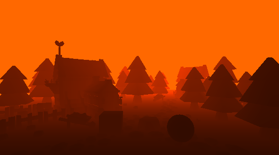
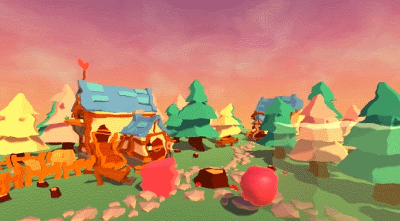
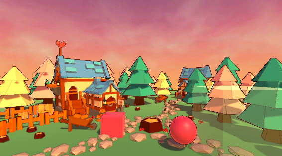
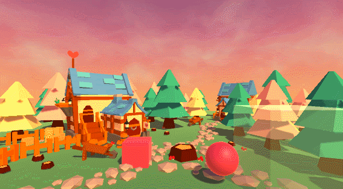
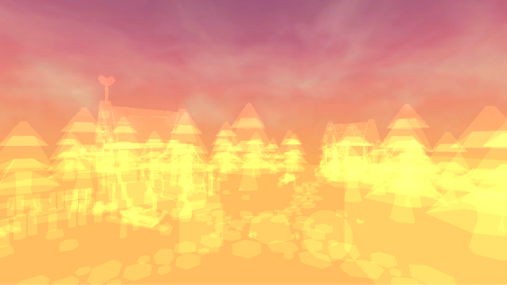

# Shaders

This is a **personal ongoing project** in which I code shaders in Unity.

I had a lot of fun discovering and understanding them in a student project during the last summer vacations ([OctopusProject](https://github.com/OctoClo/OctopusProject)), so I decided to continue learning how to code shaders.

Here are some examples:

And here are some links to the tutorials that helped me:

* The **Makin' Stuff Look Good** channel on Youtube: [link](https://www.youtube.com/channel/UCEklP9iLcpExB8vp_fWQseg)
* **Ronja's Shader Tutorials**: [link](https://www.ronja-tutorials.com/)